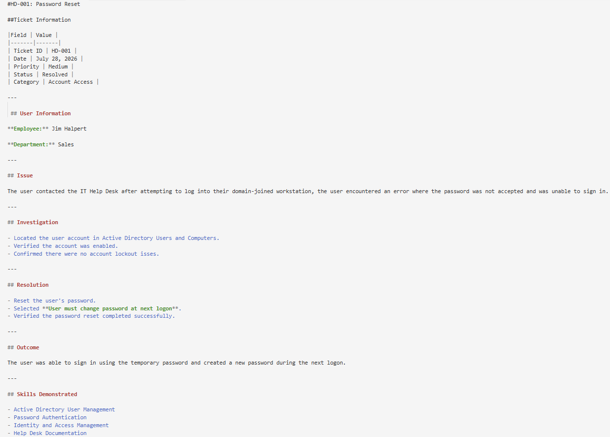

# HD-001: Password Reset

## Ticket Information

|Field | Value |
|-------|-------|
| Ticket ID | HD-001 |
| Date | July 28, 2026 |
| Priority | Medium |
| Status | Resolved |
| Category | Account Access |

---

 ## User Information

**Employee:** Jim Halpert

**Department:** Sales

---

## Issue

The user contacted the IT Help Desk after attempting to log into their domain-joined workstation, the user encountered an error where the password was not accepted and was unable to sign in.

---

## Investigation

- Located the user account in Active Directory Users and Computers.
- Verified the account was enabled.
- Confirmed there were no account lockout isses.

---

## Resolution 

- Reset the user's password.
- Selected **User must change password at next logon**.
- Verified the password reset completed successfully.

---

## Outcome

The user was able to sign in using the temporary password and created a new password during the next logon.

---

## Skills Demonstrated

- Active Directory User Management 
- Password Authentication
- Identity and Access Management 
- Help Desk Documentation

