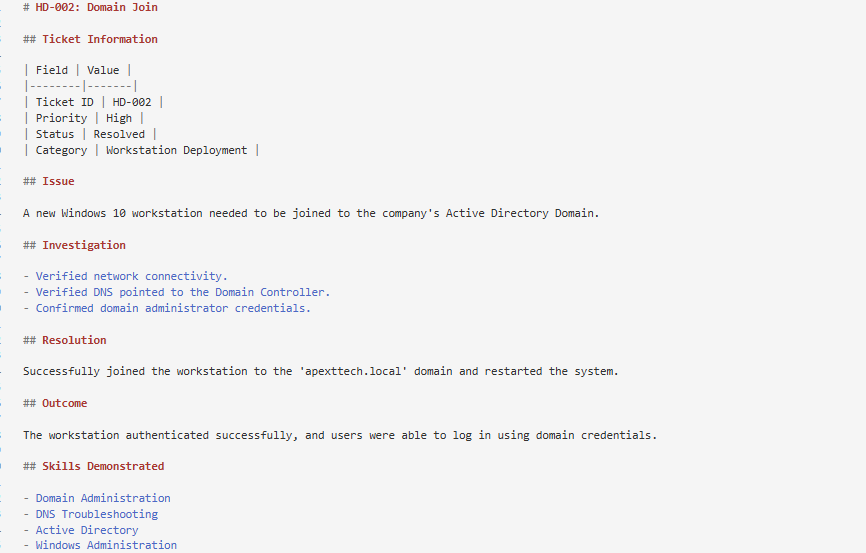

# HD-002: Domain Join

## Ticket Information 

| Field | Value |
|--------|-------|
| Ticket ID | HD-002 |
| Date | July 30, 2026 |
| Priority | High |
| Status | Resolved |
| Category | Workstation Deployment |

## Issue 

A new Windows 10 workstation needed to be joined to the company's Active Directory Domain.

## Investigation

- Verified network connectivity.
- Verified DNS pointed to the Domain Controller.
- Confirmed domain administrator credentials.

## Resolution

Successfully joined the workstation to the 'apexttech.local' domain and restarted the system.

## Outcome

The workstation authenticated successfully, and users were able to log in using domain credentials.

## Skills Demonstrated 

- Domain Administration
- DNS Troubleshooting
- Active Directory
- Windows Administration 

