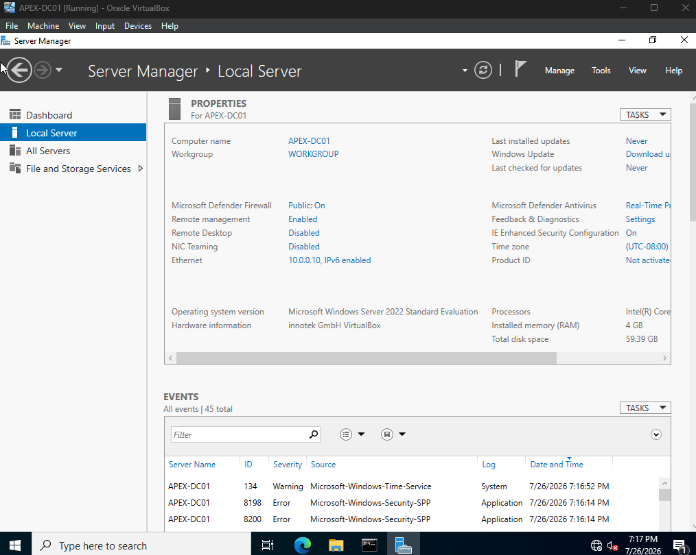
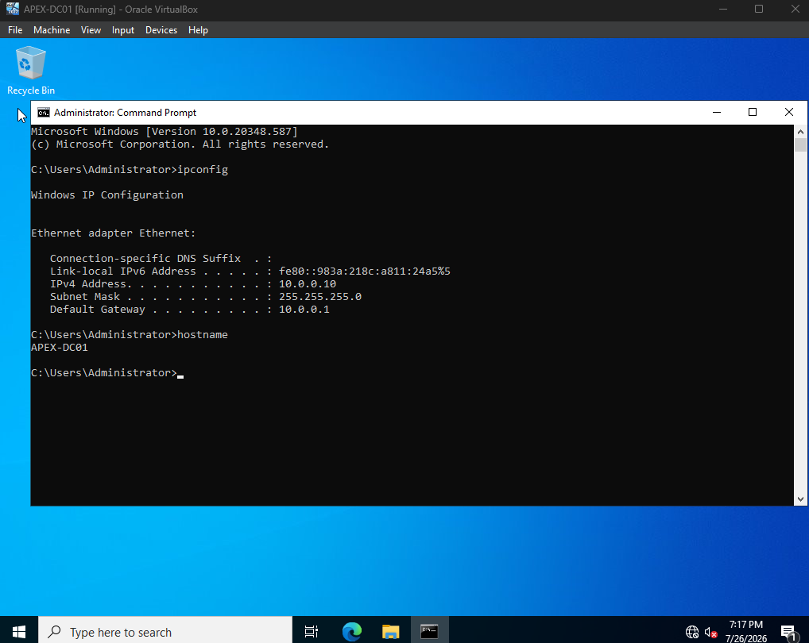
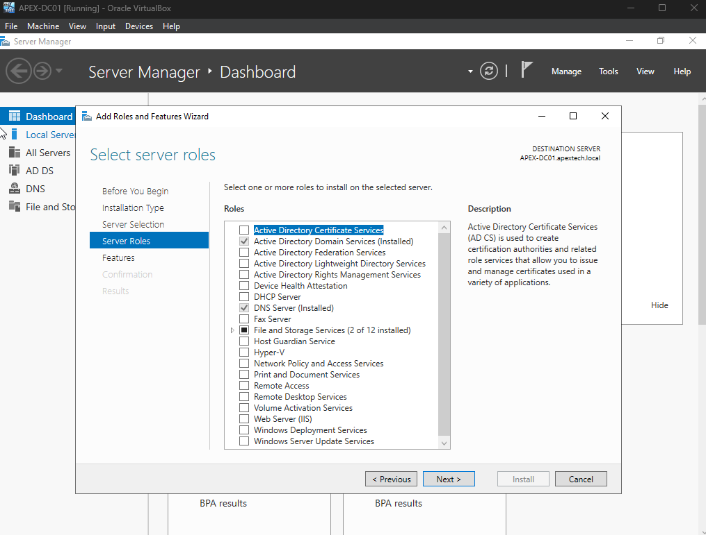
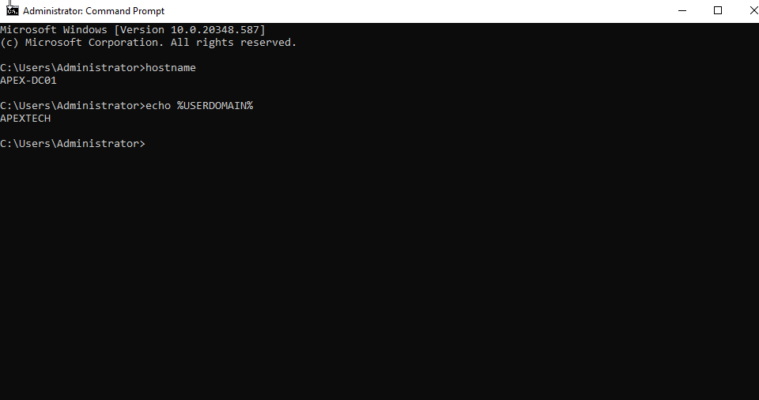
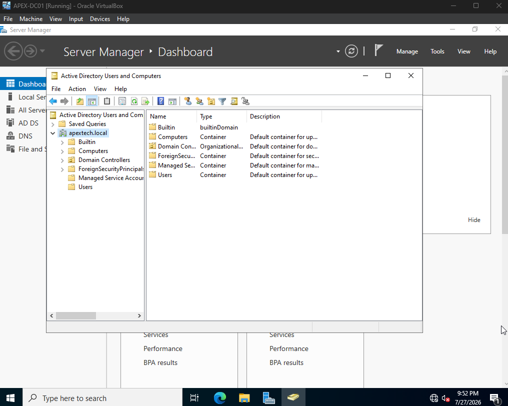
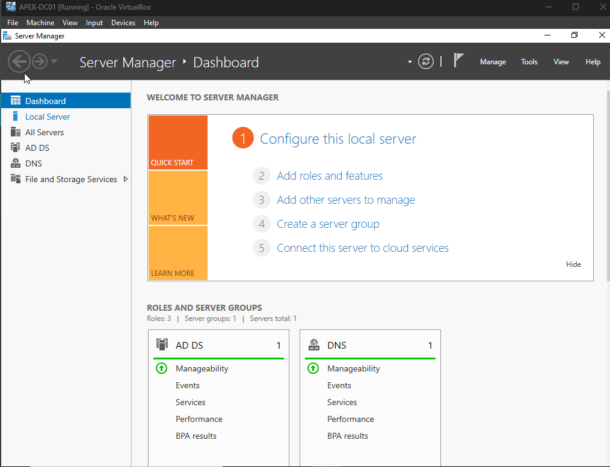

# Enterprise-Active-Directory-Lab
A hands-on enterprise IT administration lab built to simulate real-world corporate Windows environment.

07/26 - Download Windows Server 2022 Standard Evaluation Desktop Experience 
Configured setup on Oracle VirtualBox
Set up Server changed computer name to APEX-DC01

Configured Static IP in Control Panel

07/27 - Installed Active Directory Domain Services and promoted Windows Server 2022 to Domain Controller

Created the apextech.local forest and configured DNS.

07/28 - Creating Users and Groups 
