# Enterprise-Active-Directory-Lab
A hands-on enterprise IT administration lab built to simulate real-world corporate Windows environment.

## 07/26
- Download Windows Server 2022 Standard Evaluation Desktop Experience
  
- Configured setup on Oracle VirtualBox
  
- Set up Server and changed computer name to APEX-DC01
  
  
- Configured Static IP in Control Panel
  

## 07/27 

- Installed Active Directory Domain Services and promoted Windows Server 2022 to Domain Controller
  
  
  
- Created the apextech.local forest and configured DNS.
  

## 07/28 

- Created Organizational Units (OUs)
  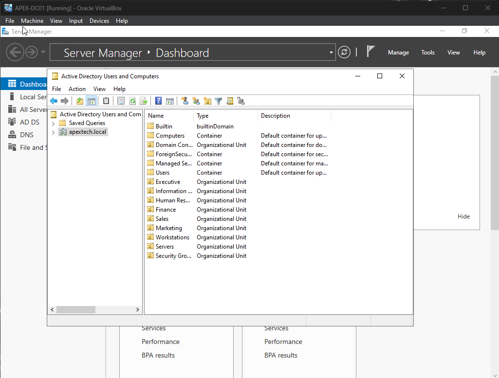
  
- Created Enterprise Users inside each OU
  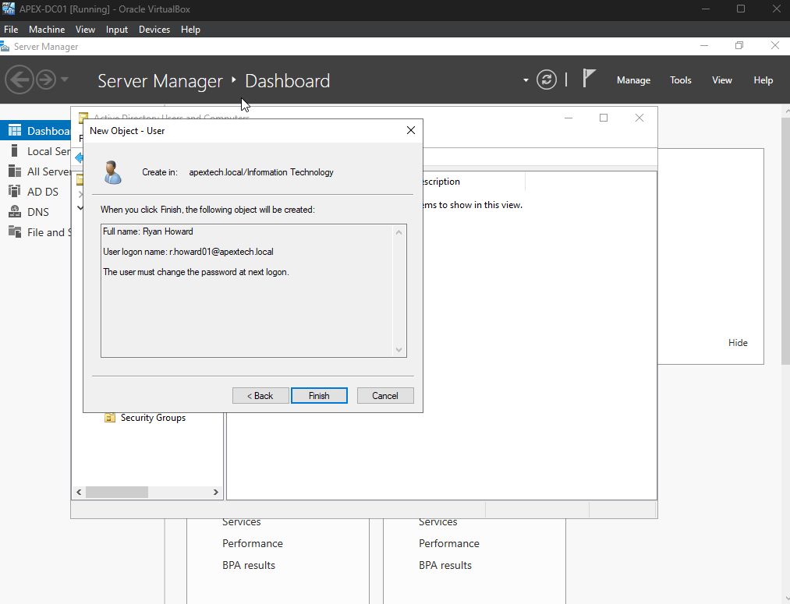
  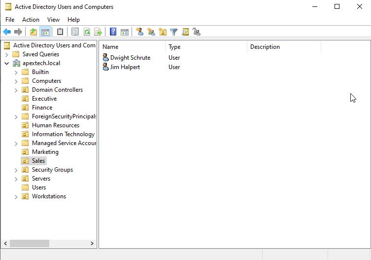

- Enforced change password at next logon
  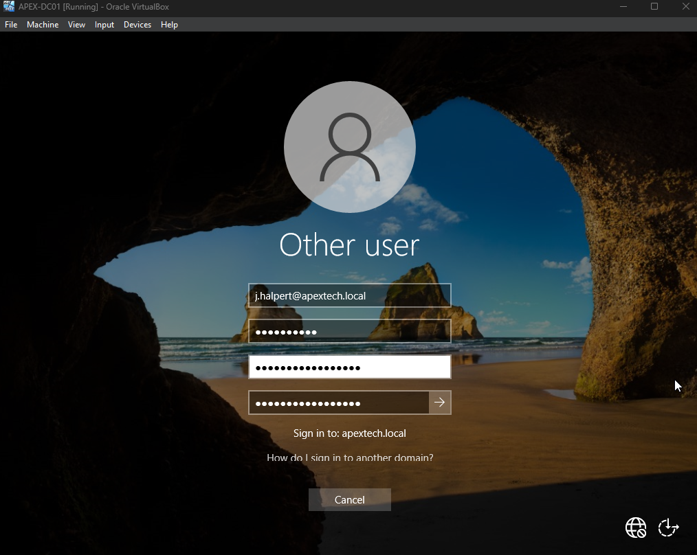
  
- Updated user properties
  
  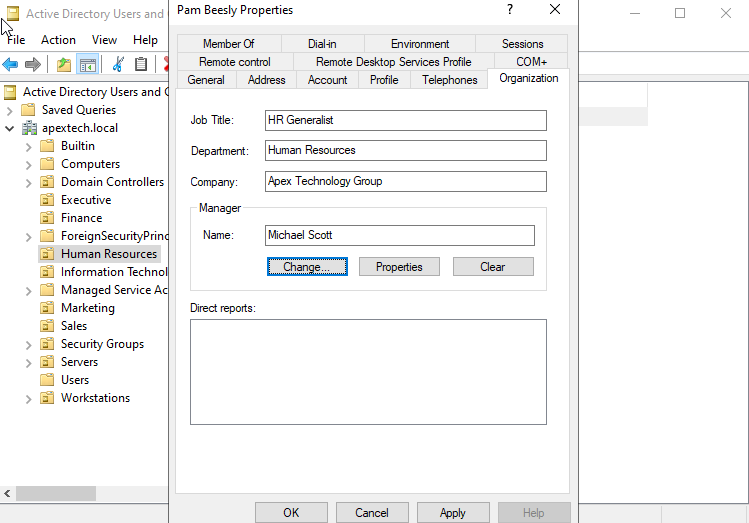
  
- Created Security Groups - Group Scope: Global | Group Type: Security
  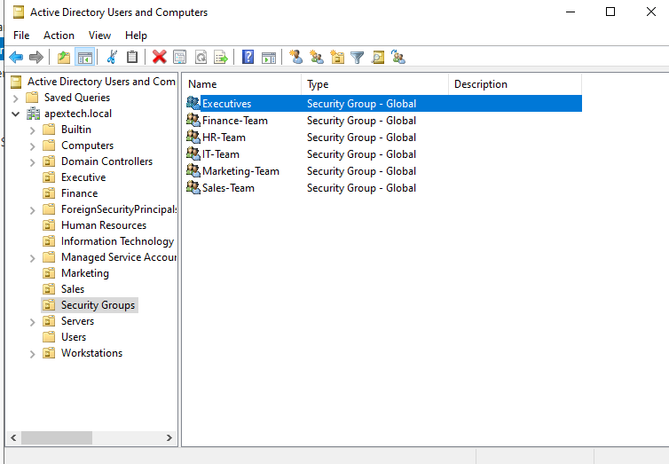
  
- Added members to each security group
  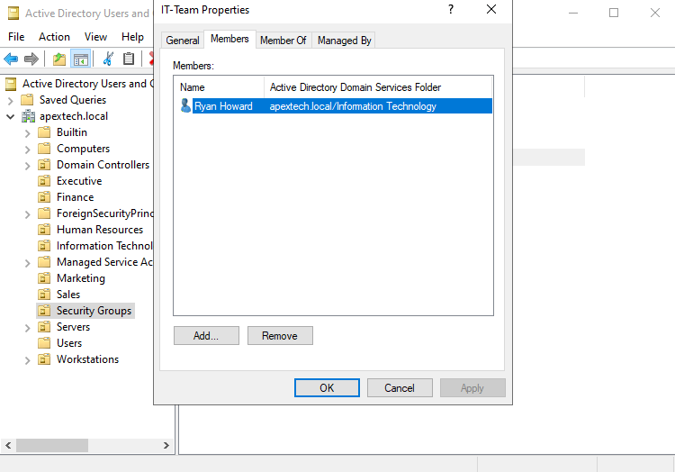
  
- Created a password reset help desk ticket - HD-001 See [Help Desk Ticket 1](HelpDesk-Tickets/HD-001-Password-Reset.md)
  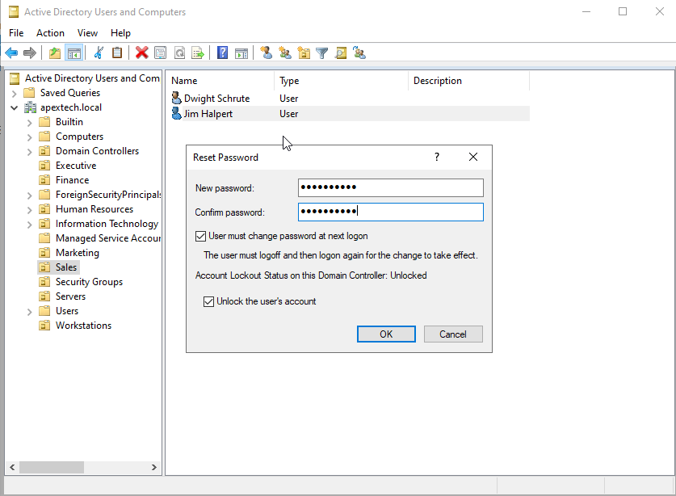

## 07/29 
Read the [Group Policy Write Up](Group-Policy.md) for more details.

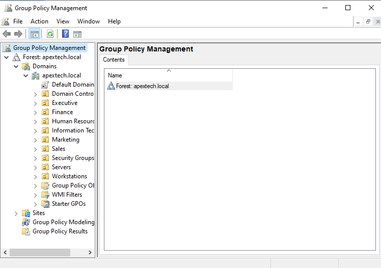

- Created a new GPO (Default Company Security Policy)
  
 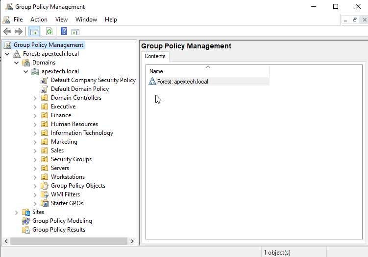

- Configured password policy
  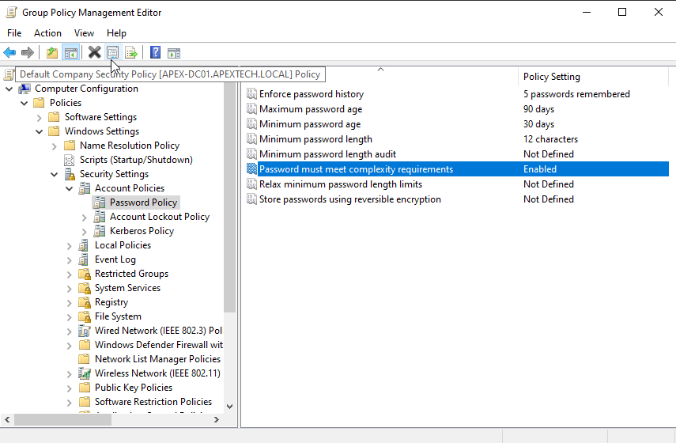

- Configured account lockout policy
  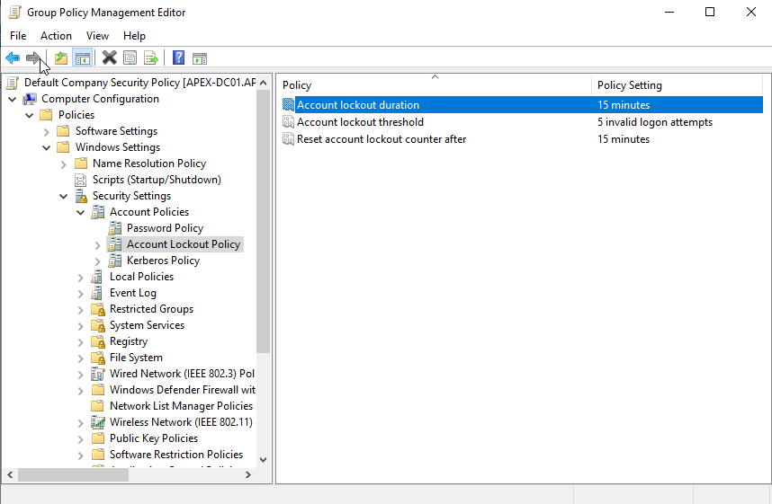

- Created sales department GPO

  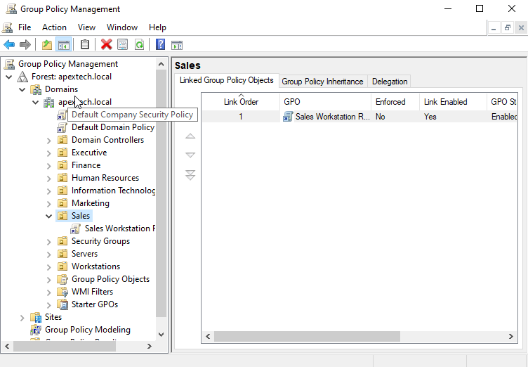

- Disabled control panel for sales
  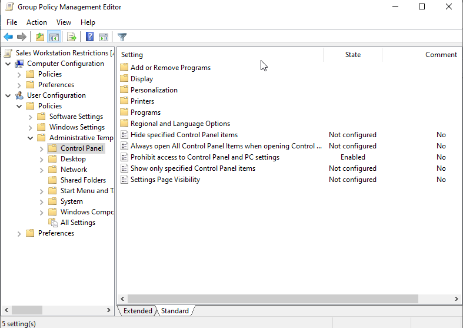

- Updated Group Policies

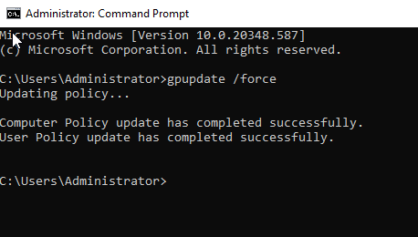

## 07/30 
Read the [Domain Joined Workstation](Domain-Joined-Workstation.md) for more details.

- Configured client static IP address
  
   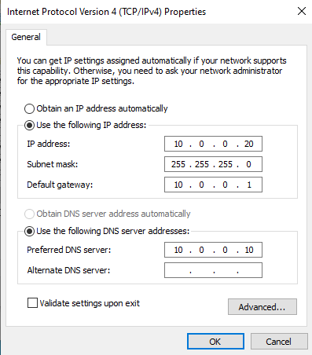

- Verified both machines were connected
  
   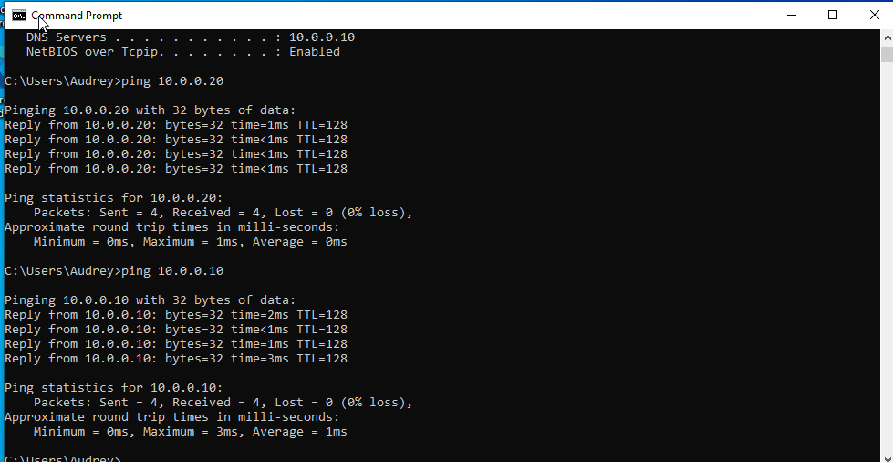

- Joined Windows 10 workstation to the Active Directory domain 'apextech.local'

    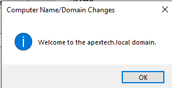

- Logged in as domain user ' Jim Halpert' and verified group policy

   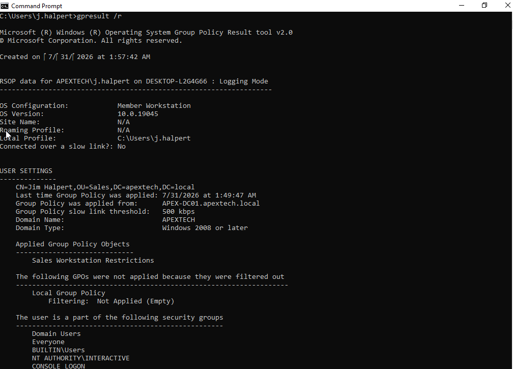

Encountered some issues with Account Lockout Policy, after attempting brute force attack on user's account, the policy did not take effect like expected. The user or threat actor would be able to brute force without any cooldown periods enforced. 

## 07/31
